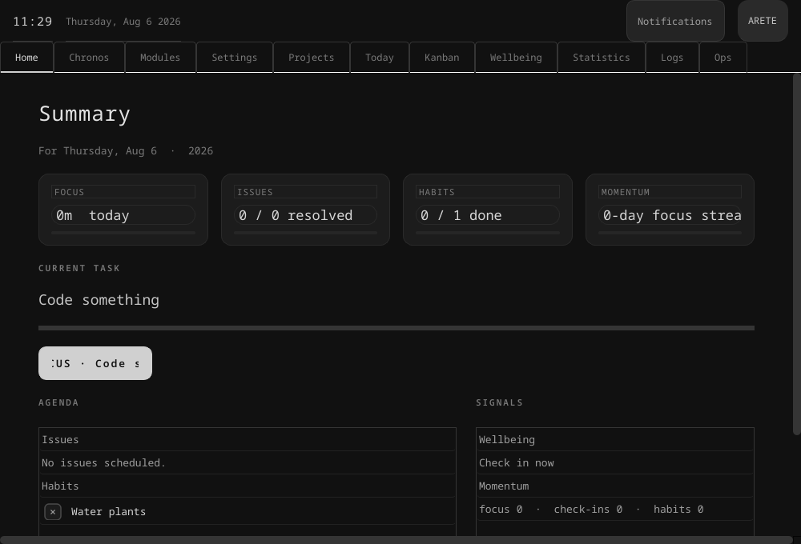

# Arete



A personal desktop OS: four core tabs — **Home, Chronos, Modules, Settings** —
plus a modular suite of productivity apps you enable and disable exactly like
an application store. Everything is stored locally; the only online feature is
the weather (and the self-update check).

Built with **C++20**, **Qt 6** and a small shared core (`AreteCore`).

## Core tabs (always on, fixed order)

- **Home** — greeting and birthday, live agenda with checkable tasks and
  habits, quick signals (weather, daily scripture, focus momentum, check-in)
- **Chronos** — the focus engine: timers, sessions, statistics; workday flows
  (Deep 50 / Pomodoro 25 / Blitz 90) and custom timers
- **Modules** — manage every optional module: enable, disable, description and
  version
- **Settings** — profile, appearance, focus intervals, weather interval,
  reminders, Codex vault, notifications, and the GitHub self-update

## Modules

Optional modules ship as a `modules/<id>/` folder, each with a `module.json`
manifest:

```json
{
  "id": "kanban",
  "name": "Kanban",
  "version": "1.0.0",
  "description": "Drag-and-drop task board.",
  "defaultEnabled": false
}
```

Toggle any module from the **Modules** tab; the tab bar is rebuilt instantly
and your choices persist.

| Module     | Purpose                                    |
|------------|--------------------------------------------|
| Today      | Daily dashboard: issues, habits, check-ins |
| Projects   | Projects with deadlines                    |
| Kanban     | Drag-and-drop task board (Active/Today/Done) |
| Calendar   | Month grid with rich events                |
| Codex      | Markdown vault with WYSIWYG Split View     |
| Logos      | Offline Bible reader with daily verse      |
| Phonio     | Music player                               |
| Journal    | Daily journal                              |
| Habits     | Habit streaks and daily marks              |
| Wellbeing  | Check-ins                                  |
| Statistics | Focus and task analytics                   |
| Alerts     | In-app alert feed                          |
| Logs       | The shared application log                 |
| Ops        | Recent operations across the shell         |
| Help       | Shortcuts, feedback and data paths         |

## Features

- **Responsive checkboxes** — custom-painted ✓ / ✕ toggles with hover,
  keyboard and focus states, reused across Home, Today, Habits and Modules
- **Interactive Home agenda** — mark issues and habits done inline; tap any
  signal to jump to its module
- **Project and event editors** — create and edit from Projects and Calendar
- **Kanban drag and drop** — drag cards between Active, Today and Done
- **Codex WYSIWYG** — Source, Reading View, or live side-by-side Split View
- **Local-first privacy** — profile, tasks, projects, events, journal and
  habits all stay in `~/.config/Arete/Arete.ini`; nothing is sent anywhere
- **Workday flows** — one-click Deep work, Pomodoro and Blitz sessions
- **Self-update from GitHub** — Settings → Updates fetches the latest release
  over the internet and replaces the installed binary (offline-safe)

## Usage

```
arete                          Launch GUI
arete --screenshot out.png     Render the Home tab and exit (headless)
```

## Build from source

### Prerequisites

| Requirement   | Minimum version      | How to check         |
|---------------|----------------------|----------------------|
| CMake         | 3.22                 | `cmake --version`    |
| C++ compiler  | GCC 11+ / Clang 14+  | `g++ --version`      |
| Qt 6          | 6.5+                 | `qmake6 --version`   |

### Install dependencies

```bash
# Debian / Ubuntu
sudo apt install build-essential cmake qt6-base-dev

# Fedora
sudo dnf install gcc-c++ cmake qt6-qtbase-devel
```

### Build

```bash
git clone https://github.com/RJohn-Ezekiel/Utilities.git
cd Utilities/Arete

cmake -S . -B build -DCMAKE_BUILD_TYPE=Release
cmake --build build -j$(nproc)
```

### Run

```bash
./build/src/arete
```

## Project Structure

```
Arete/
├── src/
│   ├── app/            — Application bootstrap, AppContext wiring
│   ├── core/           — Module base, ModuleRegistry, icons
│   ├── data/           — SQLite repositories (tasks, projects, events, journal)
│   ├── services/       — Weather, verse, timer facade, update checker
│   ├── models/         — Domain types
│   ├── ui/             — MainWindow, tabs, task toggle, dialogs
│   └── vendor/         — Vendored Chronos/Logos/Codex/Phonio engines
├── AreteCore/          — Shared core (settings, logging, notifications, updates)
└── modules/            — module.json manifests for the optional modules
```

## Install

### Quick (via install script)

```bash
cd Utilities/Arete
./install.sh
```

Installs the binary to `~/.local/bin/arete`. Pass a directory to change the
location (default `~/.local/bin`).

### Manual

1. Build (see [Build from source](#build-from-source))
2. Copy `build/src/arete` to `~/.local/bin/arete.bin`
3. Create `~/.local/bin/arete` wrapper:

```bash
cat > ~/.local/bin/arete << 'EOF'
#!/bin/bash
export QT_LOGGING_RULES="kf.*.warning=false"
export QT_QPA_PLATFORMTHEME=""
exec "$0.bin" "$@"
EOF
chmod +x ~/.local/bin/arete
```
