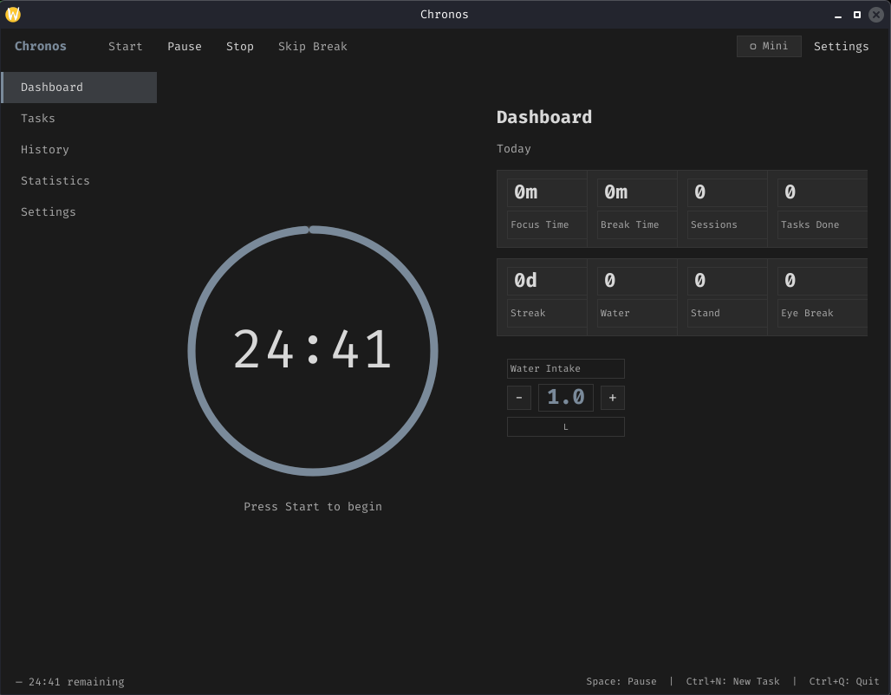

# Chronos



A cross-platform desktop focus timer with Pomodoro sessions, task management, health reminders, session statistics, and a compact mini-mode.

Built with **C++20** and **Qt 6**.

## Features

- **Focus Timer** — Pomodoro-style sessions with configurable focus and break durations
- **Task Management** — create tasks and start focus sessions tied to them
- **Health Reminders** — periodic reminders to drink water, stand, stretch, and rest your eyes
- **Statistics & History** — track total focus time, sessions completed, daily streaks
- **Mini Mode** — compact always-on-top window for minimal distraction
- **Notifications** — toast notifications and sound alerts at session boundaries
- **Water Meter** — visual hydration tracker
- **Dark theme** throughout

## Usage

```
chronos                         Launch GUI
chronos --help                  Display help
chronos --version               Show version
```

### Keyboard shortcuts

| Key       | Action              |
|-----------|---------------------|
| `Space`   | Start / Pause       |
| `Ctrl+S`  | Stop                |
| `Ctrl+K`  | Skip break          |
| `Ctrl+M`  | Toggle mini mode    |
| `Ctrl+Q`  | Quit                |

## Build from source

### Prerequisites

| Requirement   | Minimum version | How to check            |
|---------------|-----------------|-------------------------|
| CMake         | 3.22            | `cmake --version`       |
| C++ compiler  | GCC 11+ / Clang 14+ | `g++ --version`    |
| Qt 6          | 6.5+            | `qmake6 --version`      |

### Install dependencies

```bash
# Debian / Ubuntu
sudo apt install build-essential cmake qt6-base-dev qt6-multimedia-dev

# Fedora
sudo dnf install gcc-c++ cmake qt6-qtbase-devel qt6-qtmultimedia-devel

# Arch Linux
sudo pacman -S base-devel cmake qt6-base qt6-multimedia

# openSUSE
sudo zypper install gcc-c++ cmake qt6-base-devel qt6-multimedia-devel
```

### Build

```bash
git clone <repository-url>
cd Personal-Utilities/Chronos

cmake -S . -B build
cmake --build build
```

### Run

```bash
./build/chronos
```

### Run tests (optional)

```bash
cmake -B build -DBUILD_TESTS=ON
cmake --build build -j$(nproc)
./build/tests/test_chronos
```

## Project Structure

```
src/
├── main.cpp
├── core/          — Timer engine logic
├── models/        — Data models (Settings, Task, Session, Statistics)
├── storage/       — JSON file persistence
├── services/      — Timer, audio, notification, reminder services
├── ui/            — Qt widgets (dashboard, timer, settings, etc.)
└── cli/           — CLI argument parsing
```

## License

MIT
