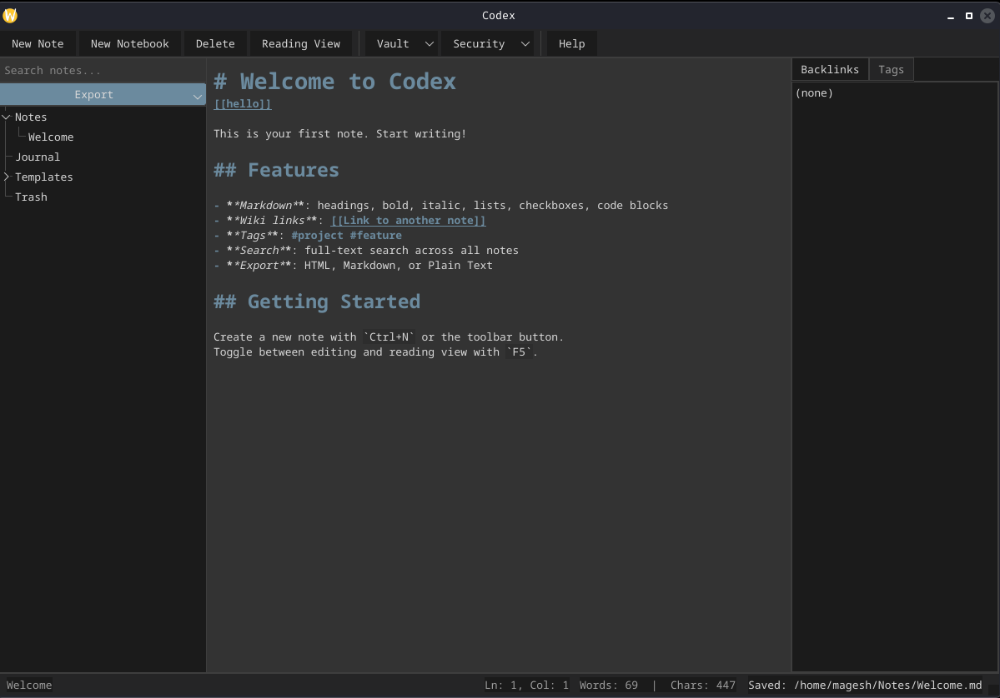

# Codex



An offline-first Markdown knowledge base with vault-based note management, full-text search, wiki links, backlinks, tags, export, and a dark theme GUI.

Built with **C++20** and **Qt 6**.

## Features

- **Vaults** — organise notes into self-contained vault directories
- **Markdown** — write in plain `.md` with headings, lists, code blocks, checkboxes, and more
- **Wiki links** — `[[Note Title]]` to link between notes; click to open or create
- **Backlinks** — automatically tracked and displayed for every note
- **Tags** — `#tagname` extracted from content; click to filter notes
- **Search** — full-text search across all notes in the vault
- **Journal** — daily auto-generated entries from a template
- **Templates** — create notes from reusable templates with `{{title}}` and `{{date}}` placeholders
- **Media** — drag-and-drop images, videos, audio files (auto-copied to vault)
- **Export** — single notes or entire vault to HTML, Markdown, or Plain Text
- **Trash** — deleted notes are moved to Trash (restorable)
- **Security** — optional vault password with SHA-256 hashing
- **Dark theme** — full dark UI with JetBrains Mono font
- **Reading view** — toggle between source and preview with `F5`
- **Autosave** — saves automatically every 3 seconds

## Usage

```
codex [vault]                  Launch GUI (opens or creates vault)
codex --create <path>          Create a new vault
codex --list <vault>           List all notes
codex --show <note>            Display note content
codex --new <title>            Create a new note
codex --search <query>         Search notes
codex --export <note> --output <dir>   Export a note
codex --all --output <dir> <vault>     Export entire vault
codex --help                   Display help
codex --version                Show version
```

## Build from source

### Prerequisites

| Requirement   | Minimum version | How to check            |
|---------------|-----------------|-------------------------|
| CMake         | 3.22            | `cmake --version`       |
| C++ compiler  | GCC 11+ / Clang 14+ | `g++ --version`    |
| Qt 6          | 6.5+            | `qmake6 --version`      |

### Install dependencies

```bash
# Debian / Ubuntu
sudo apt install build-essential cmake qt6-base-dev

# Fedora
sudo dnf install gcc-c++ cmake qt6-qtbase-devel

# Arch Linux
sudo pacman -S base-devel cmake qt6-base

# openSUSE
sudo zypper install gcc-c++ cmake qt6-base-devel
```

### Build

```bash
git clone <repository-url>
cd Personal-Utilities/Codex

cmake -S . -B build
cmake --build build
```

The binary is placed at `build/bin/codex`.

### Run

```bash
./build/bin/codex
```

Or point to an existing vault:

```bash
./build/bin/codex ~/my-vault
```

### Run tests (optional)

```bash
cmake -B build -DCODEX_BUILD_TESTS=ON
cmake --build build
./build/tests/test_codex
```

## Install

### Quick (via install script)

```bash
git clone https://github.com/RJohn-Ezekiel/Utilities.git
cd Utilities/Codex
chmod +x install.sh
./install.sh
```

### Manual

1. Build (see [Build from source](#build-from-source))
2. Copy `build/bin/codex` to `~/.local/bin/codex.bin`
3. Create `~/.local/bin/codex` wrapper:
   ```bash
   cat > ~/.local/bin/codex << 'EOF'
   #!/bin/bash
   export QT_LOGGING_RULES="kf.*.warning=false"
   export QT_QPA_PLATFORMTHEME=""
   exec "$0.bin" "$@"
   EOF
   chmod +x ~/.local/bin/codex
   ```
4. Ensure `~/.local/bin` is in your `PATH`

### Uninstall

```bash
rm -f ~/.local/bin/codex ~/.local/bin/codex.bin
```

## Vault Layout

```
MyVault/
├── Notes/             Your markdown notes (can have subfolders)
├── Media/
│   ├── Images/
│   ├── Videos/
│   ├── Audio/
│   └── Files/
├── Journal/           Daily journal entries (auto-created)
├── Templates/         Reusable note templates
├── Exports/           Generated HTML exports
├── Trash/             Deleted notes (restorable)
└── Config/
    ├── config.json
    ├── backlinks.json
    ├── tags.json
    └── search_index.json
```
