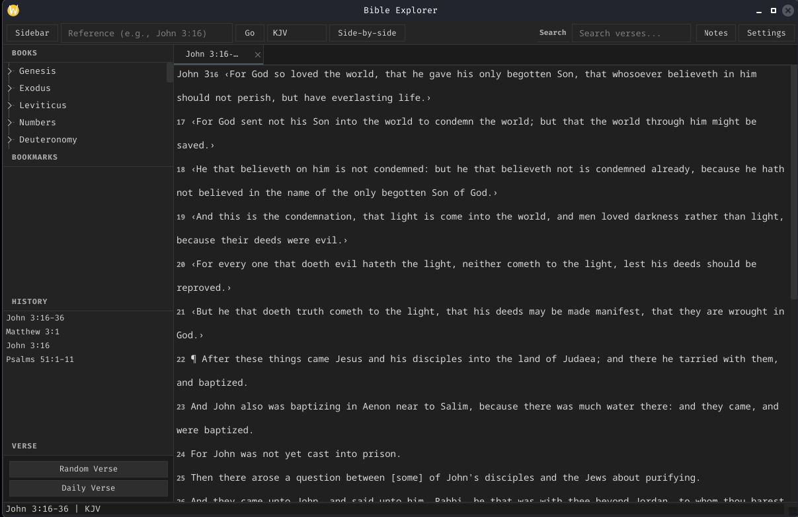

# Logos



A cross-platform desktop Bible reader with offline translations, side-by-side comparison, full-text search, bookmarks, notes, and history.

Built with **C++20** and **Qt 6**.

## Features

- **Read** any chapter or verse — type a reference (e.g. `John 3:16`) and press Enter
- **Search** full text across the active translation
- **Compare** two translations side by side with synced scrolling
- **Bookmark** verses and browse recent history
- **Notes** per passage — save, edit, and delete
- **Random** and **daily verse** at one click
- **Tabbed** navigation for multiple passages
- **Dark theme** throughout

## Usage

```
logos                          Launch GUI
logos <reference>              Display passage
logos --search <query>         Full-text search
logos --random                 Random verse
logos --today                  Daily verse
logos --help                   Display help
logos --version                Show version
```

## Build from source

### Prerequisites

| Requirement   | Minimum version | How to check            |
|---------------|-----------------|-------------------------|
| CMake         | 3.20            | `cmake --version`       |
| C++ compiler  | GCC 11+ / Clang 14+ | `g++ --version`    |
| Qt 6          | 6.5+            | `qmake6 --version`      |

### Install dependencies

```bash
# Debian / Ubuntu
sudo apt install build-essential cmake qt6-base-dev

# Fedora
sudo dnf install gcc-c++ cmake qt6-qtbase-devel

# Arch Linux
sudo pacman -S base-devel cmake qt6-base

# openSUSE
sudo zypper install gcc-c++ cmake qt6-base-devel
```

### Build

```bash
git clone https://github.com/YOUR_USERNAME/Logos.git
cd Logos
cmake -B build -DCMAKE_BUILD_TYPE=Release
cmake --build build -j$(nproc)
```

> CMake detects Qt 6 automatically on most systems.  
> If Qt 6 is installed in a custom path, add `-DCMAKE_PREFIX_PATH=/path/to/qt6`.

### Install (optional)

```bash
sudo cmake --install build
```

This copies the binary to `/usr/local/bin` and data to `/usr/local/share/bible-explorer/`.

### Run

```bash
./build/bible
```

### Run tests (optional)

```bash
cmake -B build -DBUILD_TESTS=ON
cmake --build build -j$(nproc)
./build/tests/test_bible_explorer
```

## Data

Built-in translations are in `Bibles/`:

| File          | Translation              |
|---------------|--------------------------|
| `kjv.json`    | King James Version       |
| `vulg.json`   | Latin Vulgate            |
