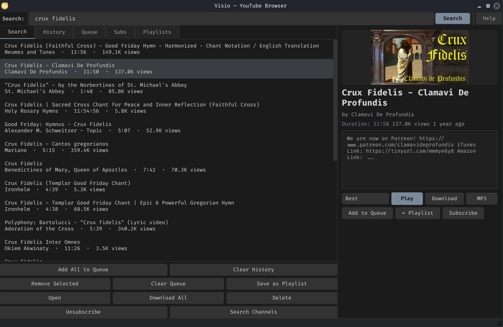

# Visio



A cross-platform desktop YouTube browser — search, stream, and download videos with a greyscale dark-theme Qt 6 GUI.

Built with **C++20** and **Qt 6**.

## Features

- **Search** — search YouTube; click any result to see title, author, duration, views, and thumbnail
- **Play** — stream videos in mpv with quality selection (Best, 720p, 1080p, 2160p, Audio Only)
- **Download** — save videos or audio to your chosen directory
- **History** — automatic watch history with remove-selected and clear
- **Queue** — build a playback queue; save it as a named playlist
- **Playlists** — save, load, and delete named playlists
- **Subscriptions** — subscribe to channels by search, view their videos and your feed
- **Video Info** — modal dialog with description, ID, and watch link
- **Greyscale dark theme** — uniform grey palette shared with Chronos, Codex, Logos, and Phonio

## Usage

```
visio                            Launch GUI (installed)
./build/visio_gui                Launch GUI (from build dir)
visio.sh <query>                 Shell client (no Qt needed)
```

Type a query in the search bar and press Enter. Click a result to see its details, then **Play**, **Download**, or **Add to Queue**. Use the tabs to browse **History**, **Queue**, **Subs**, and **Playlists**.

## Build from source

### Prerequisites

| Requirement   | Minimum version | How to check            |
|---------------|-----------------|-------------------------|
| CMake         | 3.20            | `cmake --version`       |
| C++ compiler  | GCC 11+ / Clang 14+ | `g++ --version`    |
| Qt 6          | 6.5+            | `qmake6 --version`      |

Runtime tools (searched automatically, warned if missing):

| Tool     | Required for           |
|----------|------------------------|
| `curl`   | YouTube HTTP requests  |
| `yt-dlp` | Video metadata, downloading |
| `mpv`    | Video playback         |

### Install dependencies

```bash
# Debian / Ubuntu
sudo apt install build-essential cmake qt6-base-dev curl yt-dlp mpv

# Fedora
sudo dnf install gcc-c++ cmake qt6-qtbase-devel curl yt-dlp mpv

# Arch Linux
sudo pacman -S base-devel cmake qt6-base curl yt-dlp mpv

# openSUSE
sudo zypper install gcc-c++ cmake qt6-base-devel curl yt-dlp mpv
```

### Build

```bash
git clone https://github.com/RJohn-Ezekiel/Utilities.git
cd Utilities/Visio

cmake -S . -B build -DCMAKE_BUILD_TYPE=Release
cmake --build build -j$(nproc)
```

> CMake detects Qt 6 automatically on most systems.
> If Qt 6 is installed in a custom path, add `-DCMAKE_PREFIX_PATH=/path/to/qt6`.

### Run

```bash
./build/visio_gui
```

### Run tests (optional)

```bash
cmake -S . -B build -DVISIO_BUILD_TESTS=ON
cmake --build build -j$(nproc)
./build/visio_tests
```

## Project Structure

```
include/visio/       Public headers — Client (PIMPL), error, types, search, video, channel, playlist, ui/Theme.h
src/                 Implementation — client, parsers, http_util (subprocess), gui/ (MainWindow)
tests/               test_client, test_search, test_types
examples/            search, video_info, queue_playlist examples
visio.sh             Bash shell client (works without Qt)
```

## Install

### Quick (via install script)

```bash
cd Utilities/Visio
./install.sh
```

Installs the library to `~/.local/include` + `~/.local/lib` and the GUI to `~/.local/bin/visio`. Set `PREFIX` to change the location (default `~/.local`).

### Manual

1. Build (see [Build from source](#build-from-source))
2. Copy `build/visio_gui` to `~/.local/bin/visio.bin`
3. Create `~/.local/bin/visio` wrapper:
   ```bash
   cat > ~/.local/bin/visio << 'EOF'
   #!/bin/bash
   export QT_LOGGING_RULES="kf.*.warning=false"
   export QT_QPA_PLATFORMTHEME=""
   exec "$0.bin" "$@"
   EOF
   chmod +x ~/.local/bin/visio
   ```
4. Ensure `~/.local/bin` is in your `PATH` (add `export PATH="$HOME/.local/bin:$PATH"` to `~/.bashrc` or `~/.zshrc`)

### Uninstall

```bash
rm -f ~/.local/bin/visio ~/.local/bin/visio.bin
```

## License

GNU General Public License v3.0 — see [`LICENSE`](LICENSE).
